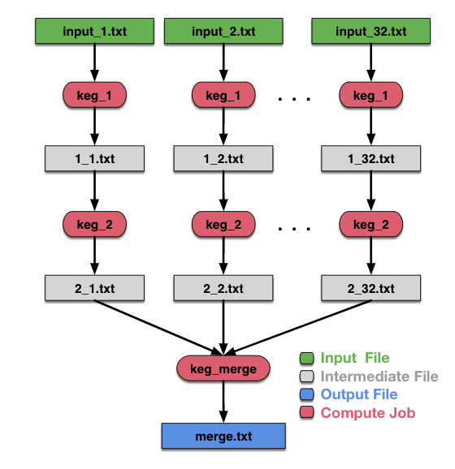

# Edge Synthetic Workflow



This is a configurable, synthetic workflow which is used to emulate data analysis pipelines meant to run on edge-cloud hybrid infrastructures.

## Usage

```
usage: workflow.py [-h] --workflow-name WORKFLOW_NAME --height [2,100] --runtime [1,300] [[1,300] ...] --output-sizes [1,90000]
                   [[1,90000] ...] [--edge-only] [--cloud-only] [--map-top-level-to-edge] [-s] [-p {pdf,png}]

Synthetic workflow. Jobs assigned to the edge (MACHINE_SPECIAL_ID=1) will incur a 33% runtime slowdown as a penalty to represent lower
powered edge devices.

optional arguments:
  -h, --help            show this help message and exit
  --workflow-name WORKFLOW_NAME
                        Name of the workflow
  --height [2,100]      Number of levels of jobs, vertically (critical path with be height number of jobs)
  --runtime [1,300] [[1,300] ...]
                        Runtime of the jobs in seconds at each level. The ith value will apply to all jobs on the ith level. The last
                        value entered will set the runtime for the current level and all subsequent levels. For example, if '--runtime 1
                        2 3' is set, then jobs at the 3rd and subsequent levels will have a runtime of 3 seconds implemented as a spin
                        lock.
  --output-sizes [1,90000] [[1,90000] ...]
                        Output file sizes of each job at each level in MB. The ith value will apply to the output files of all jobs at
                        the ith level. The last value entered will set the output file size for jobs of the current and all subsequent
                        levels. For example, if '--output-sizes 10 20 30' is set, then jobs at the 3rd and subsequent levels will have
                        output 30MB output files.
  --edge-only           Do not set staging_sites in wf.plan for edge only scenario AND set pegasus.transfer.links=True in properties.
                        Also set all jobs to run on MACHINE_SPECIAL_ID=1
  --cloud-only          Set all jobs to run on MACHINE_SPECIAL_ID=0
  --map-top-level-to-edge
                        Map all top level jobs to edge device(s) with MACHINE_SPECIAL_ID=1
  -s, --submit          Submit the workflow
  -p {pdf,png}, --plot {pdf,png}
                        Generate workflow diagram as workflow.<pdf | png>
```

